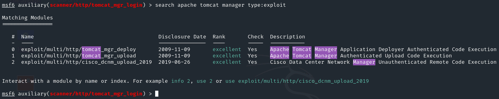
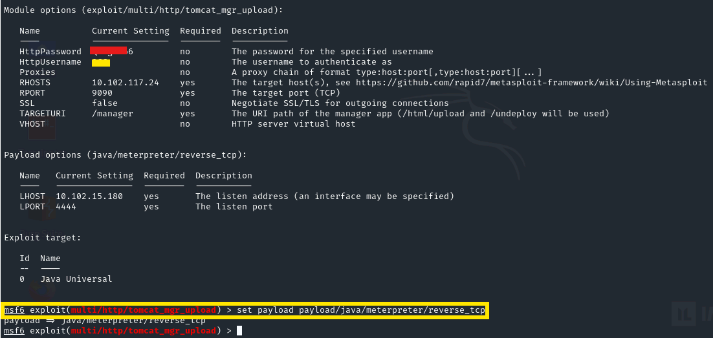
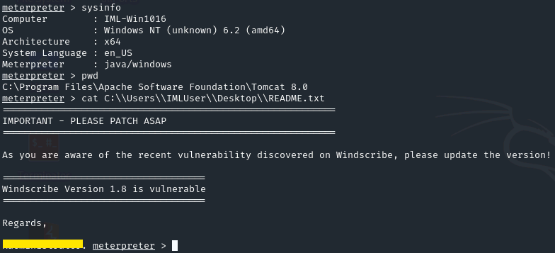
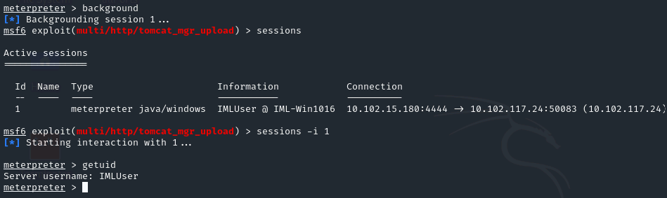
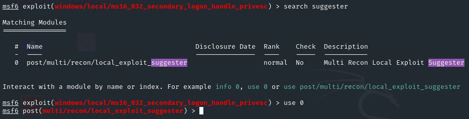
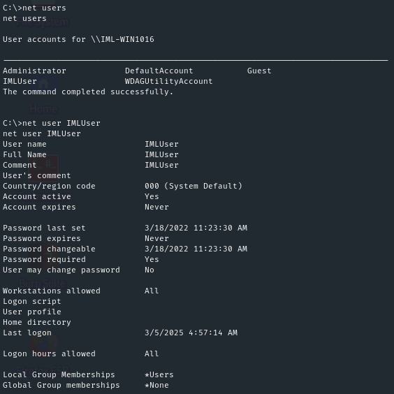
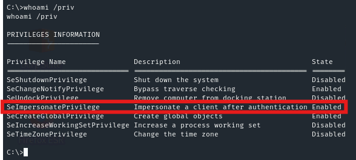

We are going to start with the Reconnaissance by scanning the target IP by running nmap however it looks the device is down however nmap is trying to validate if the device is up and running, as we know it is running we can skip "Host Discovery" by using -Pn.

```nmap
sudo nmap -T5 -v -n -Pn <IP>
```


Once we have identified the open ports, we can perform an scan over those ports trying to find more information like versions and potential vulnerabilities.

```nmap
sudo nmap -sC -sV  -p3389,8009,9090 -Pn <IP>
```


Following the instructions "Discover valid credentials to access the Manager area of the Apache Tomcat server", with this information we can use Metasploit to search for anyting related to the versions we found, I search for Apache Tomcat Manager and only for Auxiliary module.


We found an interesting module for Tomcat Application Manager Login Utility. "This module simply attempts to login to a Tomcat Application Manager instance using a specific user/pass.", once we configure all the fields, we found a username and password.


Now we have credentials, we need to search for a proper module to exploit it and obtain access to the server, I used similar search but changing the "type" to "exploit" and I found an interesting one to Upload Code Execution, I set all the fields and execute the module. After some seconds we got initial access and we can visualize the first flag.







I put the meterpreter session in the background on session 1, I tried to use local_exploit_suggester module however the payload I found did not work to escalate my privilege so I decided to enumerate the system manually.





User is not part of the "Administrators" group however there is a really interesting privilege assigned to the user, **SeImpersonatePrivilege** is a Windows privilege that grants a user or process the ability to impersonate the security context of another user or account, we can abuse of this privilege to impersonate SYSTEM user.





