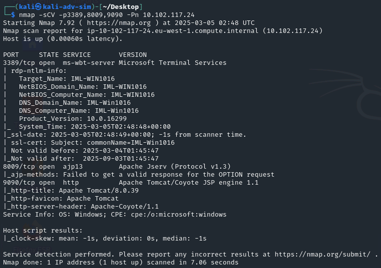
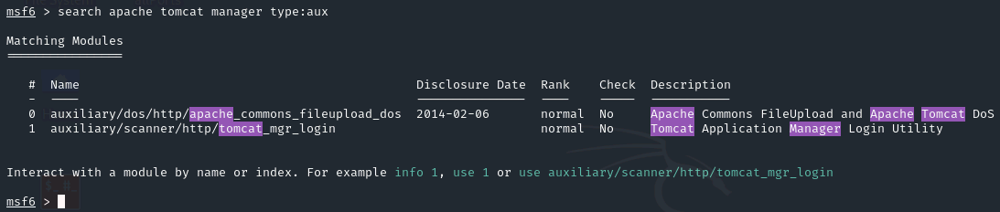
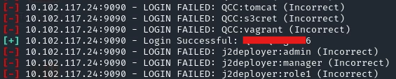

We are going to start with the Reconnaissance by scanning the target IP by running nmap however it looks the device is down however nmap is trying to validate if the device is up and running, as we know it is running we can skip "Host Discovery" by using -Pn.

```nmap
sudo nmap -T5 -v -n -Pn <IP>
```


Once we have identified the open ports, we can perform an scan over those ports trying to find more information like versions and potential vulnerabilities.

```nmap
sudo nmap -sC -sV  -p3389,8009,9090 -Pn <IP>
```



Following the instructions "Discover valid credentials to access the Manager area of the Apache Tomcat server", with this information we can use Metasploit to search for anyting related to the versions we found, I search for Apache Tomcat Manager and only for Auxiliary module.



We found an interesting module for Tomcat Application Manager Login Utility. "This module simply attempts to login to a Tomcat Application Manager instance using a specific user/pass.", once we configure all the fields, we found a username and password.


